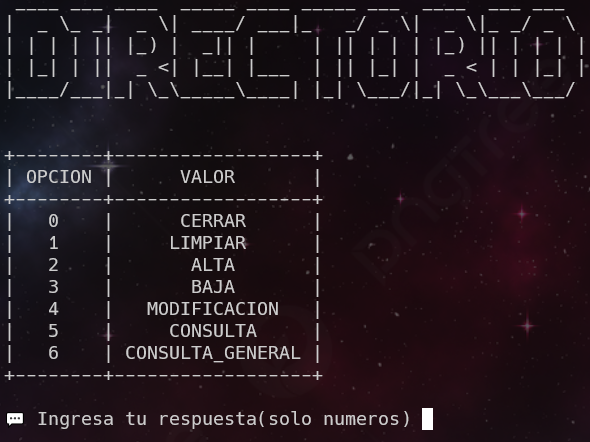

# ***Directorio De Usuarios***

Proyecto realizado a inicios de mi carrera en el desarrollo de software.

El script permite dar de alta usuarios, consutarlos, modificarlos y consulta general del directorio.

Permite dar de alta usuario, baja de usuarios, modificacion de usuarios, tambien consulta general de los usuarios y consulta especifica

# ***Requisitos***
## ***Requerimientos***
Al momento de crear este proyecto fueron usados los siguientes componentes:

- [Python](https://www.python.org/downloads/) (3.9)
- [prettytable](https://pypi.org/project/prettytable/)
- [pyfiglet](https://pypi.org/project/pyfiglet/)

# ***Instalacion***

Primero debemos instalar Python. [Clic aqui para tutorial rapido de como instalar Python](https://tutorial.djangogirls.org/es/python_installation/)

Para comprobar que se ha instalado correctamente, abrir una consola de comandos y ejecutar lo
siguiente:

- `python --version`

Si se instalo correctamente, apareca algo similar a la siguiente imagen:

Una vez hecho esto procederemos a instalar las extensiones necesarias para que funcione el proyecto, para esto es necesario abrir una consola de comandos y ejecutar las siguientes lineas:

- `pip install prettytable`
- `pip install pyfiglet`

Tambien es posible instalarlos en una sola linea:

- `pip install prettytable pyfiglet`

# Ejecucion
Para ejecutar este proyecto ejecute el siguiente comando en una consola de comandos ubicada en la carpeta donde se encuentre el archivo:

- `python main.py`

o

- `py main.py`

Una vez hecho esto si todo esta configurado correctamente se podra
visualizar el menu principal:

